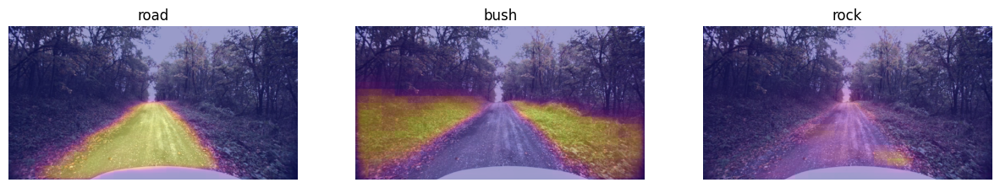
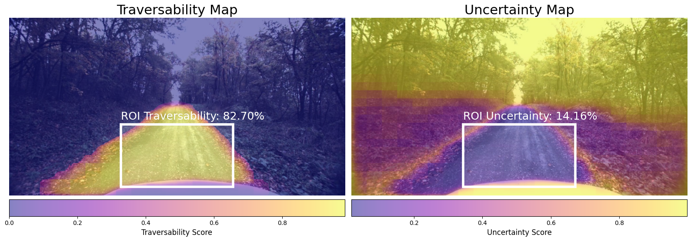

# AnyTraverse

An Offroad Traversability Framework with VLM and Human Operator in the Loop

[](https://arxiv.org/abs/2506.16826v1)
[](https://pypi.org/project/anytraverse/)


## Installation

1. **Install PyTorch:** AnyTraverse requires `torch` and `torchvision` to be installed. Install compatible `torch` and `torchvision` versions for your platform before proceeding.
   ```bash
   uv add torch torchvision       # uv users
   pip install torch torchvision  # pip users
   ```
   > :warning: _PyTorch does not provide wheels for the NVIDIA Jetson platform._ Please ensure you have installed te compatible versions of `torch`, `torchvision` for your Jetson device for GPU acceleration.
2. **Install AnyTraverse:** Install `anytraverse` using your python dependency manager. We recommend using [`uv`](https://docs.astral.sh/uv/getting-started/installation/)
   ```bash
   uv add anytraverse       # uv users
   pip install anytraverse  # pip users
   ```

### Optional

- AnyTraverse allows you to bring your own vision-language models (VLMs) and image embedding models and use them by creating wrappers. However, it also ships with some wrappers for models on [HuggingFace](https://huggingface.co/).
- To use these models, install the `transformers` package with additional dependencies.
  ```bash
  uv add transformers einops acccelerate      # uv users
  pip install transformers einops accelerate  # pip users
  ```

---

## Usage

### Quickstart

This example explains how to get started with the implementation discussed in the [original paper](https://arxiv.org/abs/2506.16826v1). To get the implementation from the paper running, use the function provided.

```python
from anytraverse import build_pipeline_from_paper


def main():
    # Load the image
    url = "https://source.roboflow.com/oWTBJ1yeWRbHDXbzJBrOsPVaoH92/0C8goYvWpiqF26dNKxby/original.jpg"
    image = PILImage.open(requests.get(url, stream=True).raw)

    # Build the pipeline from the paper
    anytraverse = build_pipeline_from_paper(
        init_traversabilty_preferences={
            "road": 1, "bush": -0.8, "rock": 0.45
        },
        ref_scene_similarity_threshold=0.8,
        roi_uncertainty_threshold=0.3,
        roi_x_bounds=(0.333, 0.667),
        roi_y_bounds=(0.6, 0.95),
    )

    # Take one step
    state = anytraverse.step(image=image)

    # Plot the attention maps
    fig, ax = plt.subplots(1, 3, figsize=(15, 5))
    for attn_map, prompt, ax_ in zip(state.attention_maps, state.traversability_preferences, ax):
        ax_.imshow(image)
        ax_.imshow(attn_map.cpu(), cmap="plasma", alpha=0.4)
        ax_.set_title(prompt)
        ax_.axis("off")
    plt.show()

    # See the traversability and uncertainty maps
    fig, ax = plt.subplots(1, 2, figsize=(16, 9))
    (x0, y0), (x1, y1) = state.roi_bbox
    rects = [
        patches.Rectangle(
            (x0, y0),
            x1 - x0,
            y1 - y0,
            edgecolor="#ffffff",
            facecolor="#ffffff22",
            linewidth=4,
        )
        for _ in range(2)
    ]
    for ax_, m, r_roi, title, rect in zip(
        ax,
        (state.traversability_map, state.uncertainty_map),
        (state.traversability_map_roi.mean(), state.uncertainty_map_roi.mean()),
        ("Traversability Map", "Uncertainty Map"),
        rects,
    ):
        ax_.imshow(image)
        map_plot = ax_.imshow(m.cpu(), alpha=0.5)
        ax_.add_patch(rect)
        ax_.text(
            x0,
            y0 - 15,
            f"ROI {title.split(' ')[0]}: {r_roi * 100.0:.2f}%",
            size=18,
            color="#ffffff",
        )
        ax_.axis("off")
        ax_.set_title(title, fontsize=22)
        cbar = plt.colorbar(map_plot, orientation="horizontal", pad=0.01)
        cbar.set_label(f"{title.split(' ')[0]} Score", fontsize=12)
        for t in cbar.ax.get_xticklabels():
            t.set_fontsize(10)
    fig.tight_layout()
    plt.show()


if __name__ == "__main__":
    main()
```

_Attention Maps_


_Traversability and uncertainty maps_


### Make your own AnyTraverse

- AnyTraverse is modular and the modules from the original paper can be swapped with your own implementation easily.
- The VLM, image encoder, traversability pooling and uncertainty pooling modules can be replaced with your own implementation, by extending abstract base classes provided in the `anytraverse` package.
- Refer to the extended documentation to learn more.

> **NOTE:** Extended documentation coming soon...

---

## Contributing

We'd love to see your implementations and modifications to help make AnyTraverse better. Please create a pull request (branch name: `dev/feat/<your-feature-name>`) to add a new feature and raise and issue to request a new feature.

---

Made with :heart: in IISER Bhopal.
