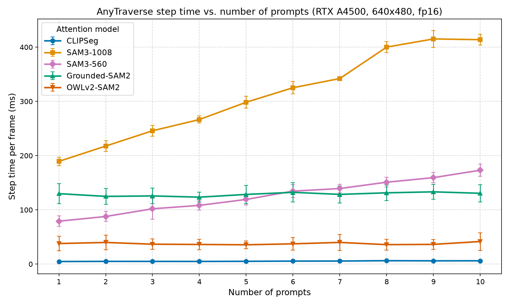

# Benchmarks

Measured with `python scripts/bench.py --size 640 480 --frames 20` on an
**NVIDIA RTX A4500 (20 GB), CUDA, `float16`**. Attention mappings use 5 prompts
(`road`, `grass`, `bush`, `rock`, `tree`); figures are steady-state means after
5 warmup frames on the full prompt count. Each model is benchmarked in isolation
with the CUDA memory cache cleared in between, so peak VRAM is per model.

## Prompt attention mappings (per frame, 640x480, 5 prompts)

| Model | Class | Mean | p95 | Peak VRAM |
|---|---|---:|---:|---:|
| CLIPSeg | `CLIPSegAttentionMapping` | 5.3 ms | 5.7 ms | 0.35 GB |
| SAM 3 @1008 | `SAM3AttentionMapping` | 286.1 ms | 306.2 ms | 2.12 GB |
| SAM 3 @560 | `SAM3AttentionMapping(image_size=560)` | 120.6 ms | 135.5 ms | 1.85 GB |
| Grounding DINO-T + SAM 2-T | `GroundedSAM2AttentionMapping` | 123.1 ms | 146.2 ms | 1.09 GB |
| OWLv2-B + SAM 2-T | `OWLv2SAM2AttentionMapping` | 40.2 ms | 67.6 ms | 0.57 GB |

## Scene encoders (per frame, 640x480)

| Model | Class | Mean | p95 | Peak VRAM |
|---|---|---:|---:|---:|
| CLIP ViT-B/32 | `CLIPImageEncoder` | 2.8 ms | 3.4 ms | 0.27 GB |
| SigLIP 2-B NaFlex | `SigLIP2ImageEncoder` | 3.9 ms | 4.9 ms | 0.86 GB |
| DINOv2-S | `DINOv2ImageEncoder` | 6.8 ms | 23.4 ms | 0.13 GB |

## Step time vs. number of prompts

Measured with `python scripts/bench_scaling.py --max-prompts 10 --frames 20`
(5 warmup frames per prompt count, 10 prompts:
`road`, `grass`, `bush`, `rock`, `tree`, `mud`, `sand`, `gravel`, `puddle`, `fence`).
Raw numbers: [`assets/prompt_scaling.csv`](../assets/prompt_scaling.csv).

Takeaways:

- **SAM 3 scales linearly** — about +24 ms per prompt at 1008px and +10 ms at
  560px — because each prompt costs a pass through the detector and mask
  decoder (vision embeddings are shared).
- **CLIPSeg (~5 ms), OWLv2-SAM 2 (~40 ms) and Grounded-SAM 2 (~130 ms) are
  flat**: the image/detections are computed once per frame and extra prompts
  only add cheap decoder work (CLIPSeg) or nothing at all (detector mappings,
  which detect all prompts in one pass).
- Practical rule: with more than ~6 prompts, SAM 3 @560 beats Grounded-SAM 2
  on speed; below that, the detector mappings win.

## End-to-end pipeline estimates (attention + encoder, 5 prompts)

| Pipeline | ~Latency | ~VRAM | Notes |
|---|---|---:|---|
| Paper (CLIPSeg + CLIP) | ~8 ms (~120 fps) | ~0.6 GB | best for small boards |
| OWLv2-SAM 2 + DINOv2 | ~47 ms (~21 fps) | ~0.7 GB | small objects, low memory |
| Grounded-SAM 2 + SigLIP 2 | ~127 ms (~8 fps) | ~2.0 GB | balanced |
| SAM 3 @560 + SigLIP 2 | ~125 ms (~8 fps) | ~2.7 GB | best open-vocabulary quality under 3 GB |
| SAM 3 @1008 + SigLIP 2 | ~290 ms (~3 fps) | ~3.0 GB | maximum quality, still well under 10 GB |

## Notes

- Every combination fits comfortably in a **10 GB** budget; the heaviest
  (SAM 3 @1008 + SigLIP 2) peaks around 3 GB in fp16.
- SAM 3 at `image_size=560` is ~2.3x faster than @1008 at some accuracy cost;
  the model is trained at 1008.
- CLIPSeg encodes the image once per frame regardless of prompt count; SAM 3
  reuses vision embeddings across prompts; the detector mappings run one
  detection pass plus one SAM 2 pass per frame.
- Checkpoint caveats found while benchmarking:
  - `facebook/sam2.1-hiera-tiny` is a `sam2_video`-type checkpoint loaded into
    `Sam2Model`; it works for image segmentation with a warning.
  - The fixed-resolution `google/siglip2-base-patch16-{224,256,384,512}`
    checkpoints are the older SigLIP architecture despite their names, so the
    default is `google/siglip2-base-patch16-naflex` (genuine SigLIP 2, any resolution).
- Reproduce: `python scripts/bench.py --models clipseg sam3 sam3-560 grounded-sam2 owlv2-sam2 encoder:clip encoder:siglip2 encoder:dinov2 --size 640 480 --frames 20`.
  SAM 3 weights are gated: accept the license for
  [`facebook/sam3`](https://huggingface.co/facebook/sam3) and run `hf auth login` first.
