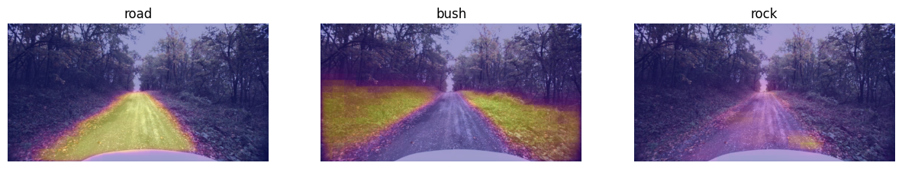
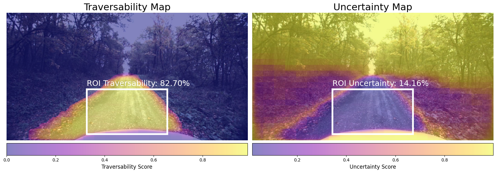

# Quickstart

This tutorial runs the pipeline from the [paper](https://arxiv.org/abs/2506.16826v1):
CLIPSeg attention maps, CLIP scene encodings, and the paper's poolers. You need
`anytraverse[hf,viz]` installed (see the [installation](../README.md#installation) section).

## Run one step

```python
import urllib.request

from anytraverse import build_pipeline_from_paper
from PIL import Image as PILImage


def main():
    # Load the image
    url = "https://source.roboflow.com/oWTBJ1yeWRbHDXbzJBrOsPVaoH92/0C8goYvWpiqF26dNKxby/original.jpg"
    with urllib.request.urlopen(url, timeout=60) as response:
        image = PILImage.open(response).convert("RGB")

    # Build the pipeline from the paper
    pipeline = build_pipeline_from_paper(
        init_traversability_preferences={"road": 1, "bush": -0.8, "rock": 0.45},
        ref_scene_similarity_threshold=0.8,
        roi_uncertainty_threshold=0.3,
        roi_x_bounds=(0.333, 0.667),
        roi_y_bounds=(0.6, 0.95),
    )

    # Take one step
    state = pipeline.step(image=image)
    print(state.traversal_state, state.roi_traversability, state.roi_uncertainty)


if __name__ == "__main__":
    main()
```

`state` holds everything computed for the frame: per-prompt `attention_maps`, the
`traversability_map` and `uncertainty_map`, their ROI crops, `ref_scene_similarity`,
`roi_traversability`, `roi_uncertainty`, and the `traversal_state` decision (`OK`,
`UNKNOWN_SCENE` or `UNKNOWN_OBJECT`).

## Plot the attention maps

```python
from matplotlib import pyplot as plt

fig, ax = plt.subplots(1, 3, figsize=(15, 5))
for attn_map, prompt, ax_ in zip(
    state.attention_maps, state.traversability_preferences, ax
):
    ax_.imshow(image)
    ax_.imshow(attn_map.cpu(), cmap="plasma", alpha=0.4)
    ax_.set_title(prompt)
    ax_.axis("off")
plt.show()
```

_Attention maps_


## Plot traversability and uncertainty

```python
from matplotlib import patches

fig, ax = plt.subplots(1, 2, figsize=(16, 9))
(x0, y0), (x1, y1) = state.roi_bbox
rects = [
    patches.Rectangle(
        (x0, y0),
        x1 - x0,
        y1 - y0,
        edgecolor="#ffffff",
        facecolor="#ffffff22",
        linewidth=4,
    )
    for _ in range(2)
]
for ax_, m, r_roi, title, rect in zip(
    ax,
    (state.traversability_map, state.uncertainty_map),
    (state.traversability_map_roi.mean(), state.uncertainty_map_roi.mean()),
    ("Traversability Map", "Uncertainty Map"),
    rects,
):
    ax_.imshow(image)
    map_plot = ax_.imshow(m.cpu(), alpha=0.5, cmap="plasma")
    ax_.add_patch(rect)
    ax_.text(
        x0,
        y0 - 15,
        f"ROI {title.split(' ')[0]}: {r_roi * 100.0:.2f}%",
        size=18,
        color="#ffffff",
    )
    ax_.axis("off")
    ax_.set_title(title, fontsize=22)
    cbar = plt.colorbar(map_plot, orientation="horizontal", pad=0.01)
    cbar.set_label(f"{title.split(' ')[0]} Score", fontsize=12)
    for t in cbar.ax.get_xticklabels():
        t.set_fontsize(10)
fig.tight_layout()
plt.show()
```

_Traversability and uncertainty maps_


## Next steps

- Swap the VLM or scene encoder with `build_pipeline_sam3` /
  `build_pipeline_grounded_sam2`, or assemble `AnyTraverse` directly from any
  `PromptAttentionMapping`, `ImageEncoder` and pooler classes (see
  `anytraverse.presets.build_pipeline` and `anytraverse.interfaces`).
- When `state.traversal_state` is `UNKNOWN_SCENE` or `UNKNOWN_OBJECT`, feed
  operator feedback back with `pipeline.human_call("mud: -0.5; road: 0.9")`.
  An empty `pipeline.human_call()` (or `pipeline.register_scene()`) just
  registers the current scene. Revisited scenes are recalled from the history
  automatically.
- For latency and memory numbers per model, see [benchmarks](benchmarks.md).
